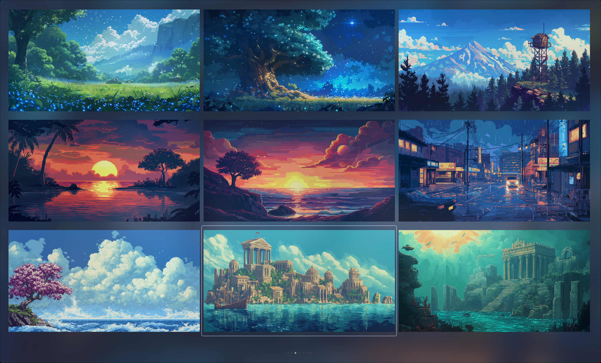

# paper-tui

paper-tui is a terminal UI wallpaper browser and setter built around the Kitty image protocol. It lets you preview high-resolution artwork, quickly switch wallpapers, and keep your wallpaper history in sync without leaving your terminal.

## Inspiration

This project takes heavy inspiration from [wallrizz](https://github.com/5hubham5ingh/WallRizz)

## Showcase

## Installation

<!-- ### Nix (flakes)

1. Clone this repository and enter it: `git clone https://github.com/Sheriff-Hoti/paper-tui.git && cd paper-tui`
2. Build the package with flakes: `nix build` (or `nix run` to execute immediately).
3. The resulting binary is available at `result/bin/paper-tui`. Optionally, `nix develop` drops you into a shell with `go` and `gopls` pre-installed.
4. Configure `~/.config/paper-tui/config.json` or pass `--config` when launching. -->

### Other Linux distributions

1. Clone this repository and enter it: `git clone https://github.com/Sheriff-Hoti/paper-tui.git && cd paper-tui`.
2. Build with Go 1.22+: `make build` (or `go build -o paper-tui`).
3. Run `./paper-tui --config path/to/config.json` to launch the TUI.

## Compatibility & Disclaimer

- paper-tui currently targets terminals that implement the Kitty image protocol. Rendering will fail on terminals without this capability.
- Development and validation happen primarily on Ghostty; other Kitty-compatible terminals should work, but they are not yet fully tested.

## Goals

- [ ] Investigate and fix the Kitty image protocol quirk where the first wallpaper is auto-applied on launch in non-Ghostty Kitty terminals.
- [ ] Provide an image-preview fallback for terminals that do not support the Kitty image protocol.
- [ ] Come up with a strategy to be able to display other image formats (atm only png format works, for other formats such as jpeg/jpg extra steps are required).
